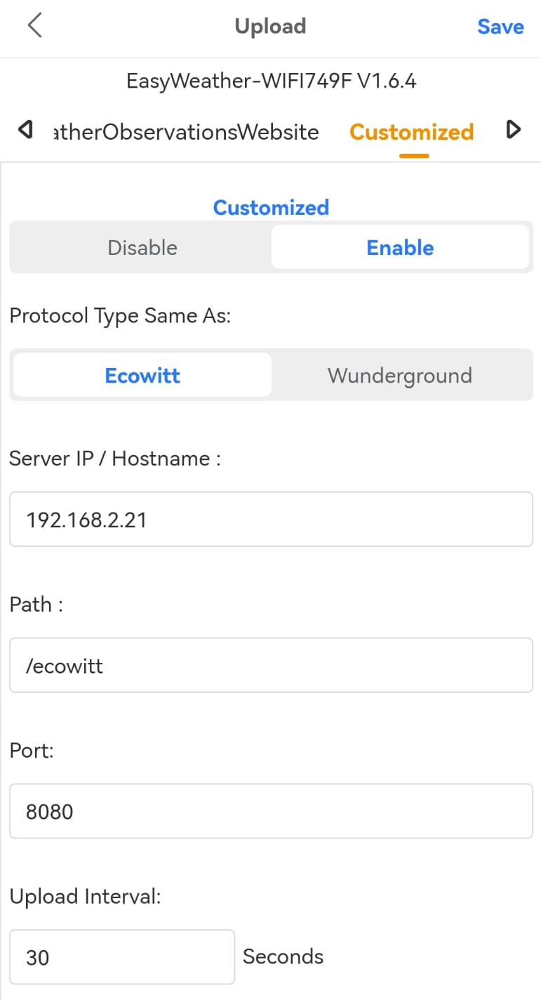
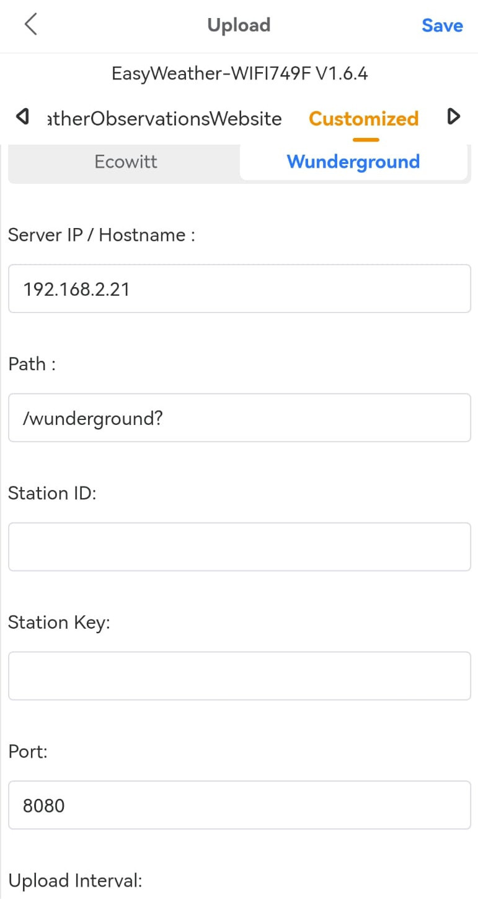

# PWS2MQTT
[]()

Captures output from ecowitt personal weather station and replays the data into MQTT. 

Supports both ecowitt format or wunderground formats

## Usage

All settings are configured through Environment Variables. 

Use the WSView app to set a custom endpoint:



Note in the wunderground the `?`at the end of the endpoint this is required.


Then see below to either run in a docker container or natively.
```bash
LISTENIP=""
LISTENPORT="8080"
MQTTSERVER=""
MQTTPORT="1883"
MQTTUSER=""
MQTTPASS=""
```

* ``LISTENIP`` -> IP Address to listen on if multiple IPs are configured, default - Listen on all
* ``LISTENPORT`` -> Port for application to listen on - Default 8080
* ``MQTTSERVER`` -> MQTT Server to send data to - Default ""
* ``MQTTPORT`` -> MQTT Port to connect to - Default 1883
* ``MQTTUSER`` -> Username to use for MQTT auth - Default ""
* ``MQTTPASS`` -> Password to use for MQTT auth - Default ""

### Docker
* ``docker run --name pws2mqtt -d -e MQTTSERVER=test.mqtt.server -p 8080:8080 pws2mqtt``

### Docker-Compose
* Edit ``pws2mqtt.env``
* ``docker-compose up``

### Native

* ``MQTTSERVER=test.mqtt.server ./pws2mqtt``

## Data formats

### Ecowitt

```json
{
  "Passkey": "XXXXXXXXX",
  "Stationtype": "EasyWeatherV1.6.4",
  "Dateutc": "2022-08-29 05:21:51",
  "Tempinf": "68.9",
  "Humidityin": "63",
  "Baromrelin": "30.095",
  "Baromabsin": "30.219",
  "Tempf": "59.7",
  "Humidity": "90",
  "Winddir": "75",
  "Windspeedmph": "5.4",
  "Windgustmph": "8.1",
  "Maxdailygust": "11.4",
  "Rainratein": "0.000",
  "Eventrainin": "0.000",
  "Hourlyrainin": "0.000",
  "Dailyrainin": "0.000",
  "Weeklyrainin": "0.000",
  "Monthlyrainin": "0.862",
  "Yearlyrainin": "0.862",
  "Totalrainin": "0.862",
  "Solarradiation": "1.28",
  "Uv": "0",
  "Wh65batt": "0",
  "Freq": "868M",
  "Model": "WS2900_V2.01.18"
}
```

### Wunderground

```json
{
  "Id": "AAAAAAA",
  "Password": "BBBBBBB",
  "Indoortempf": "68.9",
  "Tempf": "59.7",
  "Dewptf": "56.8",
  "Windchillf": "59.7",
  "Indoorhumidity": "63",
  "Humidity": "90",
  "Windspeedmph": "5.1",
  "Windgustmph": "5.8",
  "Winddir": "69",
  "Absbaromin": "30.216",
  "Baromin": "30.092",
  "Rainin": "0.000",
  "Dailyrainin": "0.000",
  "Weeklyrainin": "0.000",
  "Monthlyrainin": "0.862",
  "Solarradiation": "1.76",
  "Uv": "0",
  "Dateutc": "2022-08-29 05:24:47",
  "Action": "updateraw",
  "Realtime": "1",
  "Rtfreq": "5"
}
```
## Build Instructions

### Build native
* Install GoLang
* ``make build-native``

### Build all archs
* ``make``
### Build Docker
* ``make docker``

## TODO
* [ ] Convert Units from raw data to localised (UK, metric, imperial)
* [ ] Send STATE data to MQTT
* [ ] Helm Chart
* [ ] HASSIO Add-on
* [ ] Build binaries assets with CICD
* [ ] Upload to dockerhub
* [ ] add DEBUG output
* [ ] Tests
* [ ] Allow Topic change
